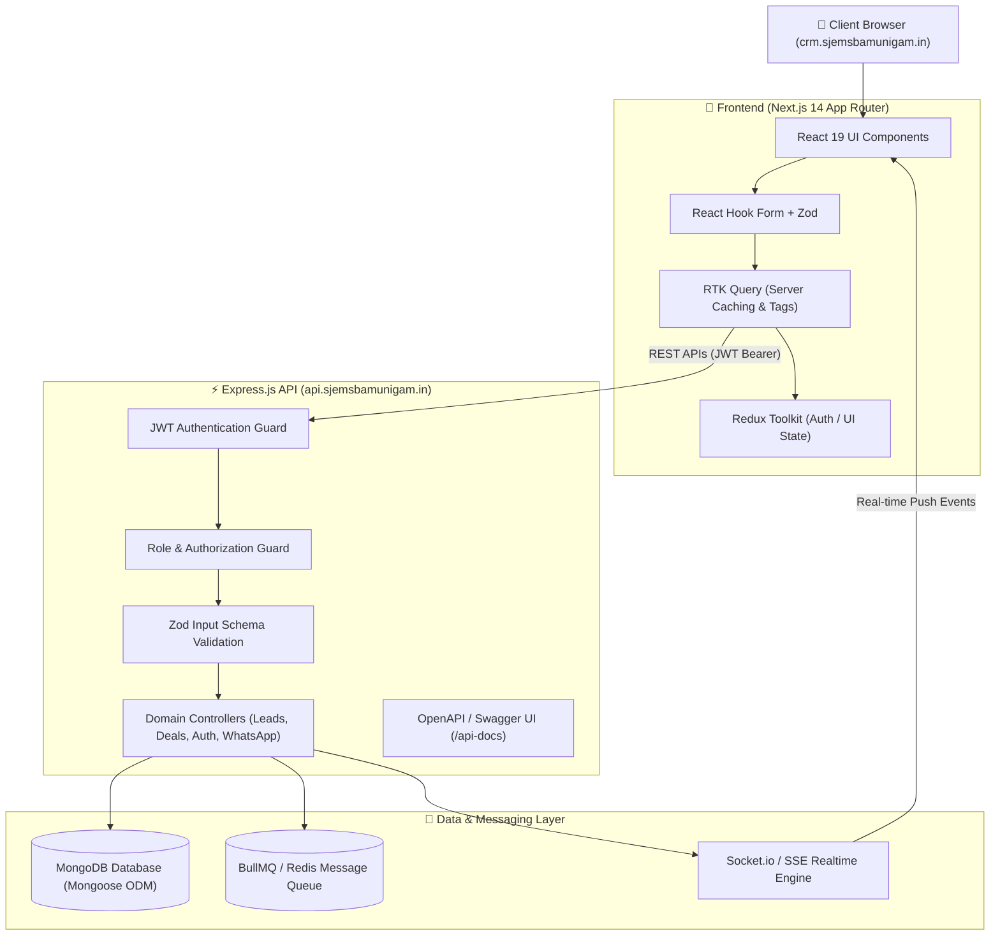

# 🚀 CRM Sales Management System

[](https://crm.sjemsbamunigam.in/)
[](https://crm.sjemsbamunigam.in/)
[](https://nextjs.org/)
[](https://react.dev/)
[](https://expressjs.com/)
[](https://www.mongodb.com/)
[](https://redux-toolkit.js.org/)
[](https://www.docker.com/)

A production-grade CRM sales application designed for automated lead ingestion, multi-channel customer communications (WhatsApp, Email, Web Forms, Social Media, Phone), transactional lead conversions, and weighted revenue forecasting. Built with **Next.js 14 App Router**, **React 19**, **Redux Toolkit & RTK Query**, **Node.js/Express.js**, **MongoDB (Mongoose ODM)**, **Zod Validation**, **TanStack DataTables**, **Recharts**, **Swagger/OpenAPI**, **Vitest**, and **Docker**.

---

## 🌐 Live Production Deployment (Hostinger VPS)

The application is deployed live on a **Hostinger VPS (Virtual Private Server)** infrastructure behind Nginx reverse proxy with SSL encryption:

| Service / Resource | Production URL |
| :--- | :--- |
| **🌐 Live Web Application (Frontend)** | [https://crm.sjemsbamunigam.in/](https://crm.sjemsbamunigam.in/) |
| **⚡ Live Backend API Base URL** | [https://api.sjemsbamunigam.in/api](https://api.sjemsbamunigam.in/api) |
| **📖 Interactive OpenAPI / Swagger Docs** | [https://api.sjemsbamunigam.in/api-docs](https://api.sjemsbamunigam.in/api-docs) |
| **📡 Realtime WebSockets / SSE** | `https://api.sjemsbamunigam.in` |

---

## 🛠️ Complete Technology Stack

### 🎨 Frontend Architecture
- **Framework**: Next.js 14 App Router with React 19
- **Styling**: Tailwind CSS with enterprise dark slate/indigo theme & dynamic glassmorphism
- **Global Client State**: Redux Toolkit (`authSlice`, `uiSlice`)
- **Server State & Data Caching**: RTK Query (`leadsApi`, `dealsApi`, `customersApi`, `dashboardApi`, `conversationsApi`, `whatsappApi`) featuring automatic tag invalidation
- **Form Handling & Validation**: React Hook Form + `@hookform/resolvers/zod`
- **Data UI Engine**: TanStack Table (`@tanstack/react-table` v9) with client & server-side pagination, sorting, and multi-field search
- **Analytics & Charts**: Recharts for pipeline distributions, revenue growth forecasts, and channel attribution
- **Real-Time Integration**: Socket.io-client & Server-Sent Events (SSE) subscribers

### ⚙️ Backend Architecture
- **Runtime & Server**: Node.js (ES Modules) with Express.js microservice architecture
- **Database & ODM**: MongoDB Atlas / local MongoDB with Mongoose ODM
- **Security & Auth**: Stateful JWT (JSON Web Tokens) Bearer Authentication & bcryptjs password hashing (10 salt rounds)
- **Validation Layer**: Zod middleware schemas (`validateRequest`) for Request Body, Path Parameters, and Query Parameters
- **Real-time Event Engine**: Socket.io event broadcasting and SSE event streams
- **Background Tasks & Queues**: BullMQ & Redis integration for batch campaign execution and webhook handling
- **API Specification**: Swagger UI (`swagger-ui-express`) and OpenAPI 3.0 specs exposed at `/api-docs`
- **Testing Engine**: Vitest & Supertest unit/integration test suite

### 🔄 CI/CD & DevOps Automation
- **Pipeline Provider**: GitHub Actions (`.github/workflows/deploy.yml`)
- **Automated Build & Verify**: Triggers automatically on `push` to `master` branch. Installs dependencies (`Backend` & `Frontend`), runs type & syntax checks, and validates Next.js production bundle compilation.
- **Automated Hostinger VPS Deployment**: Connects via encrypted SSH (`appleboy/ssh-action@v1.2.2`), performs code sync (`git reset --hard origin/master`), builds static assets, manages PM2 daemon processes (`crm-backend` & `crm-frontend`), and runs health checks.

---

## 🏛️ System Architecture & Data Flow



---

## 🔑 Core Engineering & Business Logic Principles

### 1. Deal Pipeline & Weighted Revenue Calculation
- **Pipeline Hierarchy**: `QUALIFICATION` ➔ `DISCOVERY` ➔ `PROPOSAL` ➔ `NEGOTIATION` ➔ `WON` / `LOST`.
- **Expected Revenue Engine**: Automatically computes expected weighted value:
  $$\text{Expected Revenue} = \text{Deal Value} \times \left( \frac{\text{Probability}}{100} \right)$$
- **Strict Loss Reason Enforcement**: Moving any deal stage to `LOST` strictly requires a documented `lossReason` (returns `HTTP 422 Unprocessable Entity` if omitted).
- **Stage Closure Locks**: Transitions to terminal stages (`WON` / `LOST`) automatically lock timestamp metadata (`closedAt`).

---

## 🚀 Quickstart & Setup Guide

### Prerequisites
- **Node.js**: `v18.0.0` or higher
- **Package Manager**: `npm` (v9+)
- **Database**: Active MongoDB instance (Local MongoDB or MongoDB Atlas)

---

### Step 1: Environment Setup

#### Backend Configuration (`Backend/.env`)
```env
PORT=5000
DATABASE_URL=mongodb://localhost:27017/crm_db
JWT_SECRET=super-secret-jwt-key-change-this-in-production

# Admin Initial Seed Credentials
ADMIN_NAME="Pradeep Patra"
ADMIN_EMAIL="pradeep@infotattva.com"
ADMIN_PASSWORD="securepassword"

# WhatsApp Business API Config
WHATSAPP_PHONE_NUMBER_ID=1188400177687617
WHATSAPP_WABA_ID=1308978634554139
WHATSAPP_ACCESS_TOKEN=your_whatsapp_access_token
WHATSAPP_VERIFY_TOKEN=my_secure_verify_token_123
```

#### Frontend Configuration (`Frontend/.env`)
```env
# Local Development Environment URLs
NEXT_PUBLIC_API_URL="http://localhost:5000/api"
NEXT_PUBLIC_BACKEND_URL="http://localhost:5000"
NEXT_PUBLIC_SOCKET_URL="http://localhost:5000"

# Hostinger VPS Production Live Deployment URLs
NEXT_PUBLIC_LIVE_FRONTEND_URL="https://crm.sjemsbamunigam.in"
NEXT_PUBLIC_LIVE_API_URL="https://api.sjemsbamunigam.in/api"
NEXT_PUBLIC_LIVE_BACKEND_URL="https://api.sjemsbamunigam.in"
NEXT_PUBLIC_LIVE_SOCKET_URL="https://api.sjemsbamunigam.in"
```

---

### Step 2: Install Dependencies & Run Database Seed

```bash
# 1. Setup Backend
cd Backend
npm install
npm run seed     # Populates DB with initial Users, Leads, Deals & Agents
npm run dev      # Launches Backend Server on http://localhost:5000

# 2. Setup Frontend (in a separate terminal)
cd ../Frontend
npm install
npm run dev      # Launches Next.js App on http://localhost:3000
```

---

## 🐳 Docker Deployment (Multi-Container Stack)

Run the full production stack using Docker Compose:

```bash
docker-compose up --build -d
```

### Deployed Services:
- **MongoDB**: `mongodb://localhost:27017/crm`
- **Backend Service & API Docs**: `http://localhost:5000` (Swagger UI: `http://localhost:5000/api-docs`)
- **Next.js Web Application**: `http://localhost:3000`

---

## 🔐 Pre-configured Demo Accounts

For live platform evaluations (on [https://crm.sjemsbamunigam.in/](https://crm.sjemsbamunigam.in/)) or local testing, use the pre-configured credentials below:

| Role | Email | Password | Access Scope & Responsibilities |
| :--- | :--- | :--- | :--- |
| **Client Admin** | `pradeep@infotattva.com` | `securepassword` | Workspace Admin: Full access to Dashboard, Leads CRM, Deals Kanban, Customers, Ingestion Generator, CSV Tools |
| **Sales Rep (Team)** | `sales@infotattva.com` | `securepassword` | Team Member: Assigned Leads, Follow-ups, Appointments |
| **Sales Manager** | `manager@infotattva.com` | `securepassword` | Sales Manager: Team allocation, agent performance review, pipeline management |

---

## 🧪 Automated Testing Suite

The backend contains automated integration & unit tests powered by **Vitest** & **Supertest**.

```bash
cd Backend
npm run test
```

### Verified Test Cases:
- ✅ Authentication failure on missing / invalid JWT Bearer header (`401 Unauthorized`)
- ✅ Calculation of expected revenue based on deal value and probability percentage
- ✅ Probability bounds verification (enforces `0 <= probability <= 100`)
- ✅ Rejection of deal status transition to `LOST` when `lossReason` is absent (`422 Unprocessable Entity`)
- ✅ Prevention of duplicate lead conversion attempts (`409 Conflict`)

---

## 🎯 Recommended Interview Demo Walkthrough

1. **Authentication & System Login**:
   - Access [https://crm.sjemsbamunigam.in/](https://crm.sjemsbamunigam.in/) (or `http://localhost:3000`) and log in as `pradeep@infotattva.com` (`securepassword`).
   - Observe JWT token storage and user profile loading into Redux state.
2. **Dashboard & Data Visualization**:
   - View analytics graphs powered by Recharts (Monthly pipeline trends, lead channel breakdown, team performance stats).
3. **Leads Management & TanStack DataTable**:
   - Navigate to **Leads**. Test client/server search filtering, priority dropdown updates, agent assignment, and CSV export.
   - Click **⚡ Ingestion Script Generator** to inspect auto-generated JavaScript, Python, cURL, and HTML embed snippets.
4. **Transactional Lead Conversion**:
   - Select an active lead and click **Convert**.
   - Input Deal Title, Deal Value ($25,000), Probability (60%), and initial Stage (`QUALIFICATION`).
   - Submit and verify atomic execution: Lead turns `CONVERTED`, Customer record is created, and Deal appears on Kanban.
   - Attempt converting the same lead again to demonstrate the `409 Conflict` duplicate protection.
5. **Kanban Deal Pipeline & Business Rules**:
   - Navigate to **Deals Pipeline**. View Kanban columns.
   - Move a deal to `LOST` without entering a loss reason -> observe Zod validation error alert.
   - Provide a valid loss reason to complete the transition.
6. **OpenAPI / Swagger Documentation**:
   - Visit [https://api.sjemsbamunigam.in/api-docs](https://api.sjemsbamunigam.in/api-docs) to interactively execute endpoints via Swagger UI.

---

## 📁 Repository Structure Overview

```text
CRM-project-interview/
├── Backend/                    # Express.js API Microservice
│   ├── src/
│   │   ├── config/             # DB Connection & Swagger Config
│   │   ├── controllers/        # Lead, Deal, Auth, Customer, Agent Controllers
│   │   ├── middlewares/        # Auth (JWT), Scope Guard, Zod Validator, Error Handler
│   │   ├── models/             # Mongoose Schemas (User, Company, Lead, Customer, Deal, etc.)
│   │   ├── routes/             # Express API Routers
│   │   ├── utils/              # Mappers, Helpers & Seed Utilities
│   │   ├── index.js            # Express Server & Socket.io Entrypoint
│   │   └── seed.js             # Database Seeding Script
│   ├── tests/                  # Vitest + Supertest Test Suite
│   └── README.md               # Dedicated Backend Documentation
├── Frontend/                   # Next.js 14 Web Application
│   ├── src/
│   │   ├── app/                # App Router Pages (admin, team, embed, auth)
│   │   ├── components/         # Shared UI Components, Modals, TanStack Tables
│   │   ├── store/              # Redux Toolkit Slices & RTK Query APIs
│   │   └── utils/              # Export CSV, Sockets, API Clients
│   └── README.md               # Dedicated Frontend Documentation
├── docker-compose.yml          # Multi-container Orchestration
└── README.md                   # Root End-to-End Enterprise System Readme
```

---

## 📜 License & Author

- **Developed By**: Engineering Team
- **Live Deployment**: Hostinger VPS (`https://crm.sjemsbamunigam.in/`)
- **Version**: `1.0.0` Enterprise Edition
- **License**: Proprietary / Evaluation License
